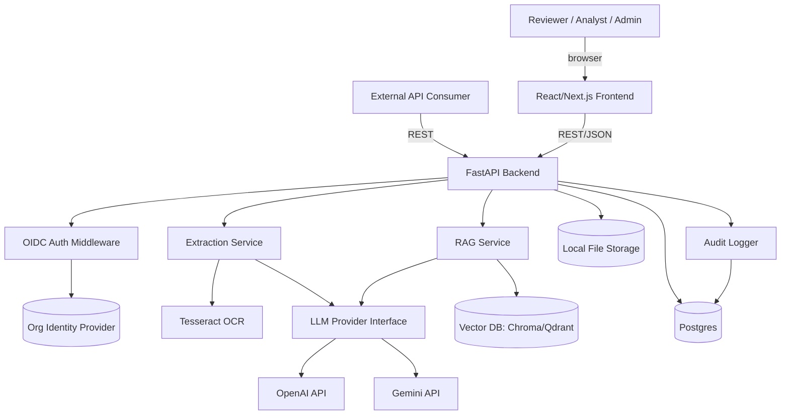
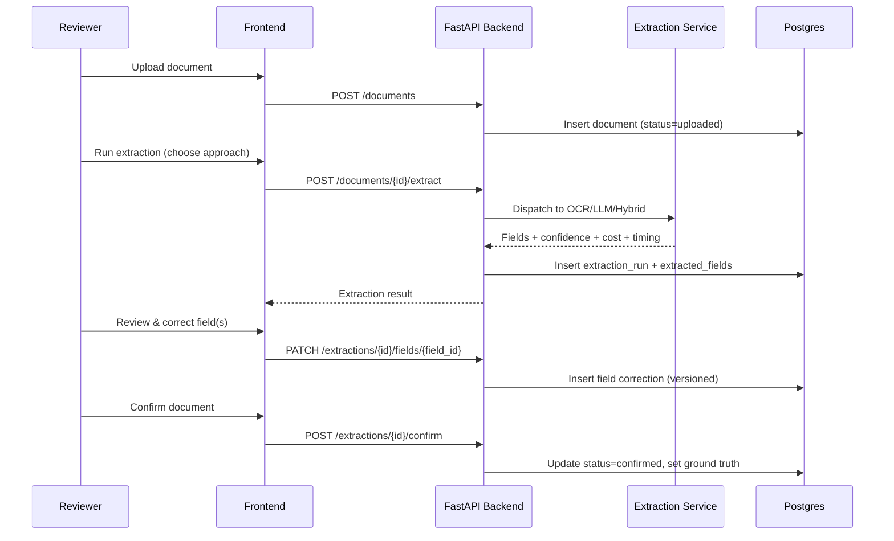
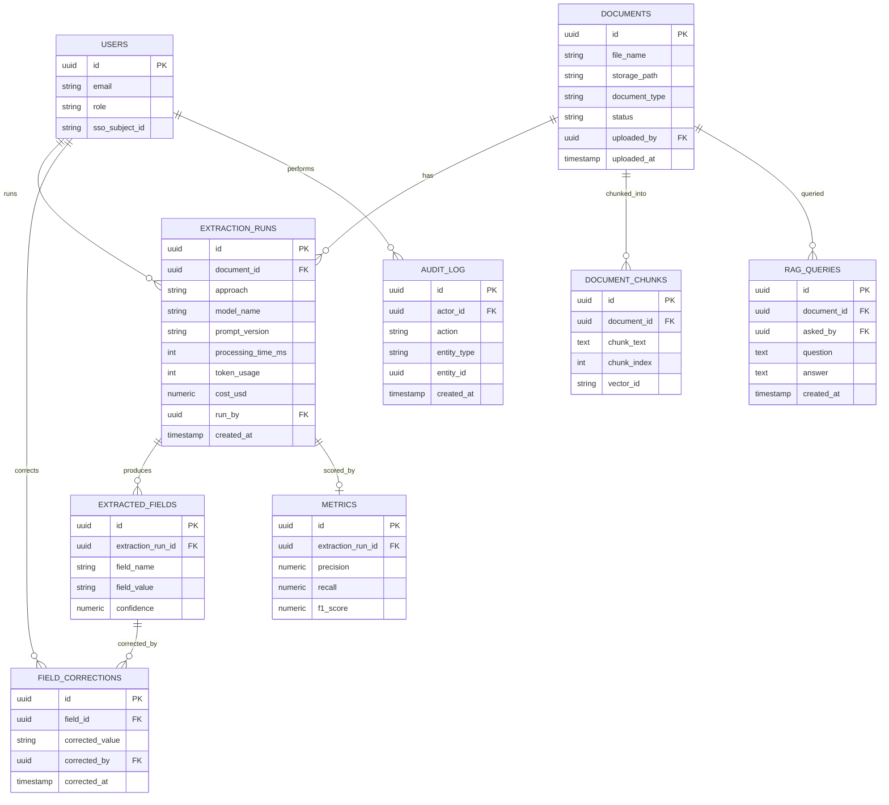

# PRD: Intelligent Document Processing (IDP) Platform for Logistics Documents

## 1. Document Control

| Field | Value |
|---|---|
| Title | Intelligent Document Processing Platform — Production Successor to FYP-1 |
| Author | Claude, on behalf of the capstone team |
| Date | 2026-09-21 |
| Version | 0.1 |
| Status | Draft |

## 2. Executive Summary

This PRD defines a production-shaped successor to **FYP-1**, a Streamlit prototype that extracts structured data from logistics documents (starting with air waybills) using OCR and LLM-based extraction, benchmarks extraction approaches against ground truth, and answers questions over extracted content via RAG. The prototype proved the concept but is not trustworthy or scalable: its flagship "LayoutLMv3" benchmark never actually runs a model, its RAG is plain TF-IDF despite claiming vector search, its "database" is unlocked flat JSON files, and it has no auth, no human review workflow, and no audit trail. This project rebuilds the same core value proposition — compare extraction methods, extract fields reliably, correct and audit results, ask questions over documents — on a real architecture, for a small team over one capstone term. It targets the company's actual product space: AI-assisted document processing for organizations (government agencies and logistics operators) that need extraction results they can trust and defend, not just a demo that looks good once.

## 3. Problem Statement & Background

Organizations that process high volumes of structured logistics/trade documents (air waybills, and eventually invoices, packing lists, purchase orders) still rely heavily on manual data entry or brittle single-method OCR. FYP-1 explored whether combining OCR, LLMs, and a hybrid approach could extract fields more accurately, and whether a RAG assistant could let staff ask natural-language questions over a document set. The prototype validated the idea but cut every corner needed to trust the results in a real workflow: no way to correct a wrong extraction, no confidence signal on any field, no record of who ran what or when, and a benchmark comparison that silently substituted regex for one of its three advertised methods. For a government or enterprise buyer, an extraction tool nobody can audit or correct is not usable — the credibility gap, not the ML accuracy gap, is the actual blocker today.

## 4. Goals & Non-Goals

**Goals**
- Replace flat-file storage with a real relational database with no data-loss/race conditions under concurrent use.
- Ship a genuine human-in-the-loop correction workflow: a reviewer can see extracted fields, see a confidence score per field, correct any field, and have corrected values become the new ground truth for future benchmarking.
- Make the extraction benchmark honest: every method listed in the UI actually runs the model it claims to, or is not listed.
- Replace TF-IDF RAG with real embeddings + a vector database.
- Add an audit trail: every extraction run and every correction is attributed to a user and timestamped.
- Expose a REST API so extraction and RAG are usable outside the web UI.
- Track LLM cost/token usage per extraction run.
- Ship as a locally deployable (Docker Compose, on-prem-capable) system, reflecting that target customers (government agencies) cannot assume unrestricted cloud access.

**Non-Goals (v1)**
- Multi-tenant SaaS (multiple separate organizations sharing one deployment) — v1 is single-organization.
- Document types beyond air waybills — invoices, packing lists, and POs are an explicit v2 extension, not v1 scope.
- Custom model fine-tuning or training infrastructure.
- A fully offline/air-gapped LLM story — v1 uses hosted LLM APIs (OpenAI/Gemini) for the LLM and Hybrid extraction approaches; a local/self-hosted model option is deferred (see Risks, §13).
- Mobile app or native clients.
- A formal security audit / penetration test (basic hardening only — see §10).
- Horizontal scaling / high-availability infrastructure — v1 targets a single-instance on-prem deployment.

## 5. Target Users & Personas

- **Reviewer / Data Entry Staff** — uploads documents, runs extraction, reviews and corrects extracted fields. Needs speed and a clear confidence signal on what to double-check.
- **Analyst / Evaluator** — the persona FYP-1's dashboard already served: compares extraction methods by accuracy/cost/speed to decide which approach to standardize on. Needs the benchmark to be trustworthy.
- **Admin** — manages users and roles (via SSO), views the audit trail, monitors LLM spend.
- **API Consumer** — a downstream system or script that submits documents and reads back structured extraction results programmatically, without touching the UI.

## 6. User Stories / Use Cases

**Must-have**
- As a Reviewer, I want to upload an air waybill and run extraction, so that I get structured fields without manual entry.
- As a Reviewer, I want to see a confidence score on each extracted field, so that I know which ones to check before trusting them.
- As a Reviewer, I want to correct a wrong field value and save it, so that the record is accurate and the correction is remembered.
- As an Analyst, I want to compare OCR, LLM, and Hybrid extraction on the same document set by precision/recall/F1/cost/latency, so that I can recommend which method to standardize on.
- As an Analyst, I want every listed extraction method to actually run the model it claims to, so that I can trust the comparison.
- As an Admin, I want to see who ran or corrected what and when, so that I can answer an audit question about any given record.
- As an API Consumer, I want to POST a document and GET back extraction results via REST, so that I can integrate this into another system.
- As any user, I want to ask a natural-language question over one or more processed documents and get a grounded answer with citations to source text, so that I don't have to read raw extraction output.

**Should-have**
- As an Admin, I want to see LLM API spend per extraction run and in aggregate, so that I can control cost.
- As a Reviewer, I want a corrected field to become the new ground truth for that document, so that future benchmark runs measure against the best-known-correct answer.

**Nice-to-have (v2+)**
- As a Reviewer, I want to upload invoices/packing lists/POs, not just air waybills.
- As an Admin, I want a self-hosted/local LLM option so no document content leaves the premises.

## 7. Functional Requirements

**Document management**
- FR-1: System supports upload of image and PDF air waybill documents.
- FR-2: Uploaded files are stored with a server-generated filename; the original filename is retained as metadata only (closes the path-traversal gap in the prototype).
- FR-3: Each document has a status: `uploaded`, `extracted`, `reviewed`, `confirmed`.

**Extraction**
- FR-4: System supports three extraction approaches: Tesseract OCR + rule-based fields, LLM-based extraction (OpenAI/Gemini, structured output), and Hybrid (OCR text fed to LLM for structuring). Each approach that appears in the UI must call the model/method it is labeled as — no silent fallback presented as a named method.
- FR-5: Each extraction run records: approach, model name, model/prompt version, processing time, token usage, cost, and a per-field confidence score (OCR: Tesseract's own confidence; LLM: model-reported or heuristic confidence).
- FR-6: Extraction runs are versioned by prompt/model version so historical comparisons aren't conflated across prompt changes.

**Human-in-the-loop review**
- FR-7: A Reviewer can view all extracted fields for a document with their confidence scores, and edit any field value.
- FR-8: Saving a correction creates a new field version, attributed to the correcting user and timestamped; the original extracted value is retained, not overwritten.
- FR-9: A Reviewer can "confirm" a document's field set, which locks it in as ground truth for that document, usable in future benchmark runs.

**Benchmarking**
- FR-10: System computes precision, recall, and F1 per extraction run against a document's confirmed ground truth (exact-match, same as the prototype, with the `far` metric either correctly implemented or removed rather than left duplicating recall).
- FR-11: Dashboard shows extraction methods compared by accuracy, processing time, and cost, filterable by document and date range.

**RAG assistant**
- FR-12: System chunks and embeds extracted document text into a vector database at confirmation time (or on demand).
- FR-13: A user can ask a natural-language question scoped to one document or a document set; the system retrieves relevant chunks via vector similarity and generates a grounded answer with the source chunk(s) cited.
- FR-14: The RAG prompt fences retrieved document content from system instructions (delimiter-based context isolation) to reduce prompt-injection risk from malicious document content.

**Auth & audit**
- FR-15: Users authenticate via SSO/OIDC against the organization's identity provider; role (Reviewer/Analyst/Admin) is assigned per user.
- FR-16: Every extraction run, correction, confirmation, and RAG query is written to an audit log with actor, action, entity, and timestamp.

**API**
- FR-17: All core actions (upload, extract, get results, correct field, confirm, query RAG) are available as authenticated REST endpoints, not just through the UI.

## 8. Technical Architecture & Tech Stack

**Confirmed stack**
- Frontend: React/Next.js SPA.
- Backend: FastAPI (Python), reusing/cleaning up the prototype's extraction logic (`ocr_engine`, `llm_engine`, `hybrid_engine`) as internal services behind the API rather than inline in UI code.
- Relational database: Postgres — documents, users, extraction runs, fields, corrections, metrics, audit log.
- Vector database: Chroma or Qdrant (separate from Postgres) — document chunk embeddings for RAG.
- Auth: OIDC against the organization's existing identity provider.
- Deployment: Docker Compose, on-prem/local-capable (Postgres, vector DB, API, and frontend all containerized; no mandatory cloud dependency except the LLM API calls themselves — see §13).
- LLM providers: OpenAI and Gemini (as in the prototype), called through a single pluggable provider interface rather than duplicated raw `urllib` calls per module.

**System architecture**

**Extraction + review sequence**

## 9. Data Model / API Design

**Core entities**

**Key API endpoints**

| Method | Path | Purpose |
|---|---|---|
| POST | `/auth/callback` | OIDC login callback |
| POST | `/documents` | Upload a document |
| GET | `/documents/{id}` | Get document + status |
| POST | `/documents/{id}/extract` | Run extraction (body: `approach`, `model`) |
| GET | `/documents/{id}/extractions` | List extraction runs for a document |
| PATCH | `/extractions/{run_id}/fields/{field_id}` | Correct a field value |
| POST | `/extractions/{run_id}/confirm` | Lock in corrected fields as ground truth |
| GET | `/metrics/benchmark` | Benchmark comparison across approaches |
| POST | `/documents/{id}/rag/query` | Ask a question scoped to a document |
| GET | `/audit-log` | Query audit trail (Admin only) |

## 10. Non-Functional Requirements

- **Data integrity**: all writes go through Postgres transactions — no unlocked full-file rewrites (closes the prototype's core storage defect).
- **Security**: uploaded filenames sanitized server-side; file type validated by content, not extension; RAG prompts use delimiter-based context fencing against injection from document content; all API endpoints require authentication; role-based authorization enforced server-side, not just hidden in the UI.
- **Auditability**: every state-changing action is attributed to a user and timestamped, queryable via the audit log endpoint.
- **Performance**: extraction runs execute asynchronously (background task/worker) so the UI/API remains responsive during OCR/LLM calls; target under 30s for a single-document extraction across all three approaches combined, under typical LLM API latency.
- **Deployability**: entire stack runs via `docker compose up` on a single on-prem host with no mandatory external network access except LLM provider calls.
- **Cost visibility**: token usage and USD cost are recorded per extraction run and aggregable by date/user/document.

## 11. Integrations & Dependencies

- **OpenAI API** — LLM and Hybrid extraction, RAG answer generation.
- **Gemini API** — alternate LLM provider, RAG answer generation (as in the prototype).
- **Organization OIDC provider** — authentication.
- **Tesseract OCR** (local binary) — OCR extraction, no path hardcoding (resolved via config/env, not a hardcoded Windows path as in the prototype).
- **Vector DB (Chroma or Qdrant)** — self-hosted via Docker Compose, no external SaaS dependency.

## 12. Milestones & Phased Rollout

Scoped for a small team (2-4 people) over ~3-4 months (~14-16 weeks).

- **Phase 0 — Setup (Weeks 1-2)**: repo scaffolding, Postgres schema + migrations, Docker Compose skeleton (API, DB, vector DB, frontend), OIDC auth wired end-to-end with a stub identity provider.
- **Phase 1 — MVP (Weeks 3-6)**: port and clean up OCR/LLM/Hybrid extraction behind the FastAPI service layer; real vector-DB-backed RAG replacing TF-IDF; basic upload → extract → view results flow in the new frontend. Goal: feature-parity with the prototype's working parts, on the new architecture.
- **Phase 2 — Core differentiators (Weeks 7-10)**: human-in-the-loop correction workflow, per-field confidence scoring surfaced in the UI, audit log, cost tracking, honest benchmark dashboard (every listed method actually runs). This phase delivers the capstone's central story.
- **Phase 3 — Hardening & demo (Weeks 11-14)**: prompt-injection fencing, filename/upload sanitization, automated tests for extraction/metrics logic, deployment packaging, demo script and documentation. Weeks 15-16 buffer for writeup/defense prep.

## 13. Risks & Mitigations

| Risk | Mitigation |
|---|---|
| On-prem deployment goal conflicts with hosted LLM APIs (OpenAI/Gemini) — document content leaves the premises for LLM/Hybrid extraction and RAG answer generation. | Documented as a known v1 limitation, not silently ignored. Provider interface (§8) is built pluggable so a local model (e.g., via Ollama) can be added in v2 without a rearchitecture. |
| Dropping LayoutLMv3 removes a differentiator the original prototype claimed (even though it never worked). | The capstone story shifts to "we found and removed a fake benchmark result and replaced it with an honest one" — itself a legitimate and defensible finding, not a weaker story. |
| SSO/OIDC integration is nontrivial and can stall a small team if the org's real identity provider isn't available for testing. | Use a local OIDC-compatible stub (e.g., Keycloak in Docker Compose) for development/demo; integrate against a real provider only if one is available before the deadline. |
| Small team, ~14-16 weeks, non-trivial scope (new frontend + backend + DB + vector DB + auth). | Phase 1 explicitly targets feature parity before any new capability is added, so there's always a demoable system even if later phases slip. |
| Confidence scores from OCR (Tesseract `conf`) and LLM (self-reported or heuristic) aren't directly comparable. | Document this limitation explicitly in the UI/report rather than presenting both as one normalized number; treat as a per-method signal, not a unified metric. |

## 14. Open Questions / Assumptions

- **Assumption**: field-level confidence for LLM-based extraction will be heuristic (e.g., derived from a self-consistency check or the model's own stated confidence in a structured response) since LLM APIs don't provide token-level confidence the way OCR does. Needs a concrete method chosen during Phase 1.
- **Assumption**: "confirming" a document's fields overwrites the ground truth used for benchmarking that document going forward; the PRD does not specify whether ground truth itself should be versioned. Flagged for a design decision before Phase 2.
- **Assumption**: cost tracking uses each provider's reported token usage from the API response (available for OpenAI and Gemini) rather than a separate token-counting library.
- **Open question**: which specific OIDC provider will be used for the demo/deployment (Keycloak stub vs. a real org provider) — affects Phase 0 setup time.
- **Open question**: whether the `far` (false-alarm-rate) metric from the prototype should be properly implemented or simply removed — it currently duplicates recall and its intended definition wasn't documented anywhere in the prototype.
- **Skipped section**: no dedicated Accessibility subsection beyond noting it in NFRs — not a primary evaluation criterion for a capstone demo audience, but should not be ignored if this becomes a real product.

## 15. Appendix

- **Glossary**: IDP = Intelligent Document Processing; OCR = Optical Character Recognition; RAG = Retrieval-Augmented Generation; OIDC = OpenID Connect; F1/Precision/Recall = standard extraction-accuracy metrics computed against ground truth.
- **Source material**: analysis of `github.com/lydianzr/FYP-1` (cloned and read in full — `app.py` and all `modules/*.py`), covering architecture, tech stack, data model, and identified engineering/product gaps that this PRD directly addresses.
