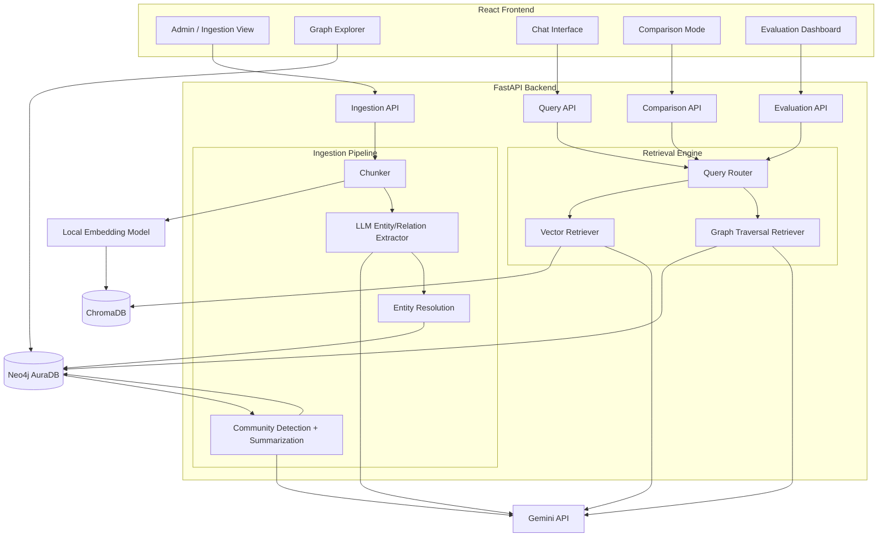
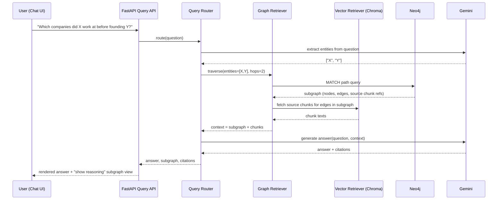
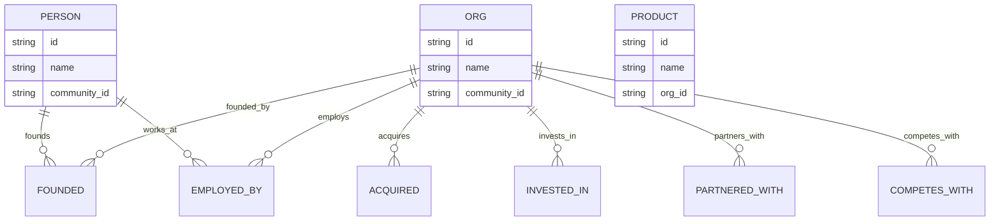

# Graph RAG Capstone — Product Requirements Document

## 1. Document Control

| | |
|---|---|
| **Title** | Graph RAG Capstone: Knowledge-Graph-Augmented Retrieval System |
| **Author** | Claude, on behalf of the project team |
| **Date** | 2026-09-22 |
| **Version** | 1.0 |
| **Status** | Draft |

---

## 2. Executive Summary

This project builds a Graph RAG system that answers questions over a corpus of tech-industry business news by combining knowledge-graph traversal with vector search, and demonstrates — with a working UI and a live side-by-side comparison — why this beats standard vector-only RAG on questions that require connecting facts across multiple documents (multi-hop questions). The deliverable is a full-stack application: an ingestion pipeline that builds a knowledge graph from news articles, a hybrid retrieval engine, a chat interface, an interactive graph explorer, and a comparison mode that runs the same question through generic RAG and Graph RAG side by side so the difference is visible, not just claimed. The project is scoped to run entirely on free-tier infrastructure so cost is not a blocker to iterating.

---

## 3. Problem Statement & Background

Standard RAG (embed chunks, retrieve by cosine similarity, stuff into a prompt) works well when the answer lives in a single chunk that's semantically close to the question. It fails in two well-documented ways:

1. **Multi-hop questions**: "Which companies did [Person X] work at before founding [Company Y]?" requires connecting facts from several different articles. No single chunk contains the answer, so similarity search either retrieves the wrong chunks or misses the connection entirely.
2. **Global/corpus-level questions**: "What are the main partnership trends across this dataset?" has no single source chunk — the answer is a synthesis across the whole corpus, which chunk-level retrieval isn't built to produce.

A knowledge graph built from the same corpus makes entity relationships explicit and traversable, so multi-hop questions become graph-path queries instead of similarity-search guesses, and community detection over the graph enables corpus-level summarization that vector RAG structurally cannot do.

This matters as a capstone specifically because the failure mode is demonstrable: the same question, run through both systems, produces a visibly worse answer from generic RAG and a correct, explainable answer from Graph RAG. That contrast is the project's evaluation story and its demo in one.

---

## 4. Goals & Non-Goals

### Goals
- Build a working knowledge graph automatically from a corpus of ~300–500 tech-industry news articles (entities: people, companies, products; relationships: acquired, invested in, partnered with, founded, employed by, competes with).
- Build a hybrid retrieval pipeline that combines vector search and graph traversal, and a community-summarization path for global questions.
- Build a generic vector-RAG baseline using the *same* corpus and *same* LLM, so comparisons are apples-to-apples.
- Ship a UI with: document ingestion/admin view, interactive graph explorer, chat interface with citations, and a side-by-side comparison mode showing the retrieval path (subgraph) used for each answer.
- Build an evaluation harness with a benchmark set of local (single-fact), multi-hop, and global questions, scored for retrieval accuracy and faithfulness, so the "Graph RAG wins on multi-hop" claim is measured, not just asserted.
- Run entirely on free-tier services (LLM API, vector store, graph database) so the team can iterate without a budget constraint.

### Non-Goals (out of scope for this version)
- Production-scale corpus (tens of thousands of documents) — this is a capstone demo at hundreds-of-documents scale, not a production system.
- Real-time/streaming ingestion of live news feeds — ingestion is a batch process the team runs on a fixed corpus snapshot.
- Multi-tenant auth, user accounts, or permissions — this is a single shared demo instance for the team and evaluators.
- Multimodal extraction (tables, charts, images) — corpus is text-only news articles; that's a different capstone direction (option 4 from earlier discussion) and explicitly not this one.
- Production-grade uptime/SLA — this needs to run reliably for development and for the capstone defense/demo session, not 24/7 for the public.

---

## 5. Target Users & Personas

| Persona | Needs |
|---|---|
| **Capstone team member (builder)** | Needs to ingest documents, inspect the graph as it's built, debug extraction quality, and iterate on retrieval logic. |
| **Capstone evaluator / defense audience** | Needs to ask questions live, see answers with visible reasoning (citations, graph paths), and see the generic-vs-graph comparison to understand *why* the approach is better, not just take it on faith. |
| **End demo user (grader, classmate, recruiter)** | Needs a clean, self-explanatory chat interface — shouldn't need the team to narrate every click to understand what's happening. |

These three drive different requirements: the builder needs an admin/ingestion view and graph internals exposed; the evaluator needs the comparison mode and explainability; the demo user needs a polished, simple chat UI. All three are served by the same app, different screens.

---

## 6. User Stories / Use Cases

**Must-have**
- As a builder, I want to upload a batch of news articles and watch them get processed into the graph, so I can verify extraction quality as I iterate.
- As a builder, I want to see graph stats (entity count, relationship count, community count) after ingestion, so I know the pipeline actually worked.
- As an evaluator, I want to ask a question in a chat box and get an answer with source citations, so I can trust the answer is grounded.
- As an evaluator, I want to see the same question answered by generic RAG and Graph RAG side by side, so I can see the difference directly.
- As an evaluator, I want to see the subgraph/path the system used to answer a multi-hop question, so the reasoning is inspectable, not a black box.
- As a builder, I want an evaluation dashboard showing benchmark scores for both systems, so I have quantitative evidence for the defense, not just anecdotes.

**Should-have**
- As a demo user, I want to explore the knowledge graph visually (search an entity, see its neighbors), so I can understand what the system "knows."
- As a builder, I want to re-run community detection/summarization after adding new documents, so the corpus-level summaries stay current.

**Nice-to-have**
- As a demo user, I want suggested example questions (including known-good multi-hop ones) pre-loaded in the chat UI, so I don't have to guess what to ask.
- As a builder, I want to export the benchmark results as a chart image for the capstone report/slides.

---

## 7. Functional Requirements

**Ingestion pipeline**
- **FR-1**: System accepts a batch upload of text articles (plain text or simple JSON with title/body/date/source fields) via the admin UI.
- **FR-2**: System chunks each article (target ~500–800 tokens/chunk with overlap) and stores chunks with source metadata.
- **FR-3**: System embeds every chunk using a local embedding model and stores vectors in the vector store, tagged with source article and chunk ID.
- **FR-4**: System runs LLM-based entity and relationship extraction per chunk, producing structured JSON (entities with type: PERSON/ORG/PRODUCT; relationships with type: ACQUIRED/INVESTED_IN/PARTNERED_WITH/FOUNDED/EMPLOYED_BY/COMPETES_WITH, plus source chunk reference).
- **FR-5**: System resolves duplicate entities across chunks/articles (e.g., "Sam Altman" vs "Altman" vs "OpenAI CEO Sam Altman") using name normalization plus an LLM-assisted merge step for ambiguous cases, and upserts into the graph rather than creating duplicate nodes.
- **FR-6**: System writes entities and relationships into the graph database, with each relationship edge carrying a pointer back to its source chunk(s) for citation.
- **FR-7**: System runs community detection (Louvain) over the graph and stores a community ID on each node.
- **FR-8**: System generates an LLM summary per community (what this cluster of entities/relationships is about) and stores it for global-question retrieval.
- **FR-9**: Admin UI shows ingestion progress (per-document status: queued/chunked/extracted/graphed) and post-ingestion graph stats.

**Retrieval & query pipeline**
- **FR-10**: System classifies an incoming question as local (specific-fact), multi-hop (needs graph traversal), or global (needs community summaries) — or, if classification proves unreliable, always runs all three retrieval paths and merges results (see Open Questions).
- **FR-11 (generic RAG baseline)**: System embeds the query, retrieves top-k similar chunks from the vector store, and generates an answer from those chunks alone — no graph involvement. This is the comparison baseline.
- **FR-12 (Graph RAG)**: System extracts entities mentioned in the query, locates matching graph nodes, traverses the graph (configurable hop depth, default 2) to find connected entities/relationships relevant to the question, retrieves the source chunks referenced by those edges, and — for global questions — also retrieves relevant community summaries. All retrieved context (chunks + graph paths + summaries) is passed to the LLM for answer generation.
- **FR-13**: Every Graph RAG answer returns, alongside the text answer: the list of source chunks used (for citation) and the subgraph (nodes/edges) traversed to produce it (for the graph visualization).
- **FR-14**: Comparison mode runs FR-11 and FR-12 for the same question in parallel and displays both answers side by side with their respective evidence (chunks for generic, chunks + subgraph for graph).

**UI**
- **FR-15**: Admin/Ingestion screen — upload documents, view processing status, view graph stats.
- **FR-16**: Graph Explorer screen — interactive, searchable graph visualization; clicking a node shows its properties and connected edges.
- **FR-17**: Chat screen — ask a question, get a Graph RAG answer with inline citations; toggle to reveal the subgraph used.
- **FR-18**: Comparison screen — same question, both systems' answers, evidence for each, with a preset list of benchmark questions (including known multi-hop ones) selectable from a dropdown.
- **FR-19**: Evaluation dashboard — displays benchmark run results (accuracy/faithfulness scores per system, per question category) as a table and chart.

**Evaluation**
- **FR-20**: System includes a benchmark question set (minimum 20 questions: ~8 local, ~8 multi-hop, ~4 global) with reference answers, curated by the team from the actual corpus.
- **FR-21**: System runs both pipelines against the benchmark set and scores each answer for retrieval relevance and faithfulness (LLM-as-judge, since there's no team capacity for full human annotation at scale), producing per-category comparison metrics.

---

## 8. Technical Architecture & Tech Stack

### Confirmed stack

| Layer | Choice | Status |
|---|---|---|
| Frontend | React (Vite) + TypeScript, Tailwind CSS | Proposed, confirmed |
| Graph visualization | `react-force-graph` (or Cytoscape.js if force-graph proves too slow for the corpus size) | Proposed |
| Backend | Python, FastAPI | Proposed, confirmed |
| Graph database | Neo4j AuraDB Free (cloud, no infra to manage) | Proposed, confirmed |
| Vector store | ChromaDB (embedded/local, free) | Proposed, confirmed |
| Embeddings | `sentence-transformers` local model (e.g. `all-MiniLM-L6-v2` or `bge-small-en-v1.5`) — runs on CPU, zero API cost | Proposed, confirmed |
| LLM (extraction + generation) | Google Gemini API, free tier (`gemini-2.0-flash` / `gemini-2.5-flash`) | Proposed, confirmed |
| Community detection | `networkx` + `python-louvain`, run in the FastAPI backend against a graph snapshot pulled from Neo4j (not Neo4j's GDS plugin, which AuraDB Free does not support) | Proposed |
| Hosting (dev/demo) | Local dev for the team; optionally deploy frontend to Vercel free tier and backend to Render/Railway free tier for the defense demo | Proposed |

**Rationale for "free API" constraint**: Gemini's free tier has generous per-day rate limits and native structured-output (JSON mode) support, which is what entity/relationship extraction needs. Embeddings are run locally via `sentence-transformers` specifically to avoid *any* per-embedding API cost — at hundreds of documents with overlapping chunks, embedding calls would be the highest-volume API cost if billed. Neo4j AuraDB Free and ChromaDB (self-hosted/embedded) both have no cost at this scale. Net result: the only paid-adjacent dependency is Gemini API calls for extraction and generation, both within free-tier limits at this corpus size.

**Rationale for community detection choice**: Neo4j's Graph Data Science (GDS) library, which has built-in Louvain, is not available on AuraDB Free — only on self-managed Neo4j or paid Aura tiers. Rather than stand up a self-hosted Neo4j instance (more infra for a 4-person team to coordinate), the plan pulls the graph into `networkx` in the backend, runs Louvain there, and writes community IDs back to Neo4j as node properties. This keeps AuraDB Free viable.

### System architecture

### Query sequence (Graph RAG path)

---

## 9. Data Model

### Graph schema (Neo4j)

Every relationship edge (`ACQUIRED`, `INVESTED_IN`, `PARTNERED_WITH`, `FOUNDED`, `EMPLOYED_BY`, `COMPETES_WITH`) carries properties: `source_chunk_ids: [string]`, `source_article: string`, `date: date`, `confidence: float` (from extraction).

### Chroma vector store schema

Each vector record: `chunk_id`, `embedding`, `text`, `article_id`, `article_title`, `source_url_or_ref`.

### Key backend API endpoints

| Endpoint | Purpose |
|---|---|
| `POST /ingest` | Upload and process a batch of documents |
| `GET /ingest/status` | Poll ingestion/pipeline progress |
| `GET /graph/stats` | Node/edge/community counts |
| `GET /graph/subgraph?entity=X` | Fetch neighborhood for graph explorer |
| `POST /query` | Ask a question, get Graph RAG answer + citations + subgraph |
| `POST /query/generic` | Ask a question, get generic vector-RAG answer only |
| `POST /query/compare` | Run both pipelines, return both answers |
| `POST /eval/run` | Run the benchmark set against both pipelines |
| `GET /eval/results` | Fetch latest benchmark scores |

---

## 10. Non-Functional Requirements

- **Cost**: $0 target. All chosen services have a free tier sufficient for a 300–500 document corpus; the team should monitor Gemini API daily quota usage during bulk extraction runs and batch ingestion to stay under free-tier rate limits (extraction is the highest-volume LLM usage — roughly one call per chunk).
- **Scale**: Designed for hundreds of documents and low concurrent query volume (demo/defense scale, single-digit simultaneous users) — not a production load target.
- **Latency**: Graph RAG query end-to-end under ~8 seconds is acceptable for a live demo (multi-hop traversal + generation is inherently slower than generic RAG; this is worth calling out explicitly in the defense as an honest tradeoff, not hidden).
- **Explainability**: Every Graph RAG answer must be traceable to specific source chunks and, where applicable, a visible graph path — this is a core requirement, not a nice-to-have, since explainability is the project's central claim.
- **Reliability for demo**: The system must run reliably during the capstone defense session; a local fallback (running everything on a laptop, no cloud dependency) should be kept as a backup if live cloud services are unreliable during the demo window.
- **Accessibility**: Standard web accessibility basics (keyboard navigation, sufficient color contrast, alt text) for the chat and admin screens; the graph visualization itself is inherently visual and doesn't need a non-visual equivalent for this scope.

---

## 11. Integrations & Dependencies

| Dependency | Used for | Free tier constraint to watch |
|---|---|---|
| Google Gemini API | Entity/relation extraction, community summarization, answer generation | Free tier daily request quota — batch extraction runs should be rate-limited/throttled to avoid hitting caps mid-ingestion |
| Neo4j AuraDB Free | Graph storage and traversal queries | 200k node / 400k relationship cap (well above this project's scale), single free instance per account |
| ChromaDB | Vector storage and similarity search | Self-hosted/embedded, no external constraint |
| `sentence-transformers` | Local embeddings | Runs on CPU; team should confirm at least one dev machine can run it at acceptable speed for batch ingestion |
| News source for corpus | Raw article data | See Open Questions — needs a concrete source confirmed before ingestion work starts |

---

## 12. Milestones & Phased Rollout

No hard deadline was set, but phasing keeps the "build as we go" approach from stalling on an unbounded scope. Each phase produces something demoable.

**Phase 0 — Setup**
Repo scaffolding, Neo4j AuraDB Free instance provisioned, Gemini API key obtained, corpus source finalized (see Open Questions), FastAPI + React skeletons wired together.

**Phase 1 — Generic RAG baseline**
Chunking + embedding + Chroma ingestion; generic vector-RAG query endpoint; minimal chat UI. *Demoable: ask a question, get an answer from plain vector RAG.* This also becomes the permanent comparison baseline, so building it first isn't wasted work.

**Phase 2 — Knowledge graph construction**
LLM entity/relationship extraction, entity resolution, Neo4j ingestion, admin/ingestion UI with progress + stats. *Demoable: upload documents, watch the graph populate, inspect stats.*

**Phase 3 — Graph RAG retrieval**
Query entity extraction, graph traversal retriever, hybrid context assembly, Graph RAG query endpoint, citations + subgraph return. *Demoable: ask a multi-hop question and get a correct, cited answer.*

**Phase 4 — Comparison mode + graph explorer**
Side-by-side comparison UI, preset benchmark questions, interactive graph explorer screen. *Demoable: the core "why Graph RAG wins" narrative, live.*

**Phase 5 — Community detection + global questions**
Louvain community detection job, LLM community summarization, global-question retrieval path integrated into the router. *Demoable: ask a corpus-wide synthesis question, get an answer generic RAG structurally can't produce.*

**Phase 6 — Evaluation harness + polish**
Benchmark question set curated, automated scoring (LLM-as-judge) implemented, evaluation dashboard built, UI polish pass, demo rehearsal. *Demoable: the full defense presentation.*

Phases 1–3 are the critical path for a minimum viable demo; Phases 4–6 are what make it a strong capstone rather than a bare pipeline.

---

## 13. Risks & Mitigations

| Risk | Impact | Mitigation |
|---|---|---|
| LLM extraction is noisy (wrong entity types, missed relationships, hallucinated ones) | Graph quality directly determines demo quality | Use structured JSON output mode, validate against a fixed schema/enum of relationship types, spot-check a sample after each ingestion batch, and keep a confidence property on edges to optionally filter low-confidence ones at query time |
| Entity resolution fails (duplicate nodes for the same real-world entity) | Fragments the graph, breaks multi-hop traversal | Normalize names before matching (case, punctuation, common aliases), and add an LLM-assisted merge pass for near-duplicates; treat this as a known hard problem worth calling out honestly in the defense rather than something to silently hide |
| Gemini free-tier rate limits hit mid-batch during ingestion | Ingestion pipeline stalls or errors | Throttle/batch extraction calls with backoff; ingest in smaller batches; keep ingestion idempotent so a failed run can resume rather than restart |
| Graph visualization becomes unreadable at a few hundred nodes | Undermines the "explainability" UI selling point | Default the explorer to a filtered/local view (search-then-expand) rather than rendering the whole graph at once; only render the relevant subgraph for a given answer in the chat/comparison views |
| Team coordination overhead (4 people, shared Neo4j/Chroma instances) | Merge conflicts on shared data state during parallel development | Each dev runs a local Chroma + points to a shared AuraDB Free dev instance, or the team seeds a small fixed dataset for local dev and only ingests the full corpus into the shared instance for integration/demo runs |
| Scope creep — UI polish or extra features expand past what's needed for the defense | Timeline (even if flexible) drifts indefinitely | Phases 1–3 are the hard floor for "this works"; treat everything past Phase 3 as explicitly prioritized, cuttable scope if time runs short |

---

## 14. Open Questions / Assumptions

These need a team decision before or during the relevant phase — flagged here rather than silently assumed:

1. **Corpus source not yet finalized.** The direction confirmed is a tech-industry news/company corpus, but the exact source is still open. Recommendation: use the **NewsAPI.org free developer tier** to pull ~300–500 recent articles on tech-industry M&A, funding rounds, partnerships, and executive moves — this is naturally entity/relationship-dense (people, companies, events) and produces good multi-hop questions ("which companies did this exec work at before this move," "which companies did this investor back that later got acquired by the same acquirer"). Alternative if API access is inconvenient: a static Kaggle business-news dataset filtered to tech-sector articles. **Needs team confirmation before Phase 0 closes.**
2. **Query classification strategy (FR-10) is assumed, not confirmed.** The PRD assumes the router will attempt to classify a question as local/multi-hop/global, but this classification step is itself an open technical risk — it may be simpler and more robust to always run vector + graph traversal + relevant community summaries and let the LLM synthesize from whichever context is actually relevant, skipping explicit classification. Recommend deciding this in Phase 3 based on early results, not locking it in now.
3. **Team role split not specified.** With 4 people, the natural split is: (a) ingestion/extraction pipeline, (b) graph retrieval + generic RAG baseline, (c) frontend (all 4 screens), (d) evaluation harness + entity resolution. Assumed here for planning purposes — confirm actual assignments with the team.
4. **Deployment for the defense demo is assumed optional-cloud, fallback-local.** No hosting requirement was stated; the PRD assumes local-machine demo is acceptable with optional free-tier cloud deployment (Vercel + Render/Railway) as a stretch goal, not a requirement.
5. **Benchmark question authorship**: FR-20 assumes the team hand-writes the 20-question benchmark set from the actual ingested corpus after Phase 2, since questions need to reference real entities/relationships that exist in the data. This can't be finalized until after ingestion.
6. **Embedding model choice** (`all-MiniLM-L6-v2` vs `bge-small-en-v1.5`) is a minor assumption — either works for this scale; pick based on whichever benchmarks slightly better on retrieval quality during Phase 1, not a decision that needs to block progress.

---

## 15. Appendix

### Glossary
- **Multi-hop question**: A question whose answer requires connecting facts across two or more separate source documents/entities, rather than being answerable from a single retrieved chunk.
- **Community detection**: Graph algorithm (here, Louvain) that clusters densely-connected nodes into groups, used to generate corpus-level summaries for global questions.
- **Entity resolution**: The process of recognizing that different mentions ("Sam Altman," "Altman," "the OpenAI CEO") refer to the same underlying graph node.
- **LLM-as-judge**: Using an LLM to score answer quality (faithfulness, relevance) against a reference answer, as a scalable substitute for full human annotation.

### References
- Microsoft Research, "From Local to Global: A Graph RAG Approach to Query-Focused Summarization" — the community-detection + summarization technique this project's global-question path is based on.
- Neo4j AuraDB Free tier documentation — for confirming current node/relationship limits before build starts.
- Google Gemini API documentation — for current free-tier rate limits, which should be re-checked at Phase 0 since these change over time.
